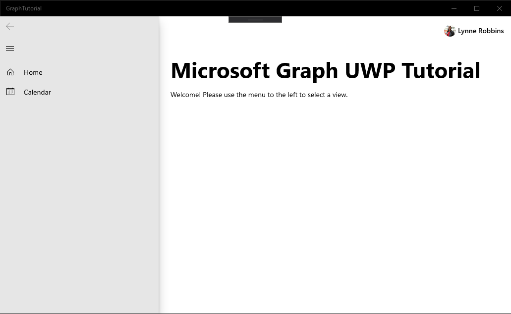

<!-- markdownlint-disable MD002 MD041 -->

Neste exercício, você estenderá o aplicativo do exercício anterior para oferecer suporte à autenticação com o Azure AD. Isso é necessário para obter o token de acesso OAuth necessário para chamar o Microsoft Graph. Nesta etapa, você integrará o controle **LoginButton** dos [controles do Windows Graph](https://github.com/windows-toolkit/Graph-Controls) para o aplicativo.

1. Clique com o botão direito do mouse no projeto **GraphTutorial** no Gerenciador de soluções e selecione **Adicionar > novo item...**. Escolha **arquivo de recursos (. resw)**, nomeie o `OAuth.resw` arquivo e selecione **Adicionar**. Quando o novo arquivo é aberto no Visual Studio, crie dois recursos da seguinte maneira.

    - **Name:** `AppId`, **Value:** a ID do aplicativo que você gerou no portal de registro do aplicativo
    - **Nome:** `Scopes`, **valor:**`User.Read Calendars.Read`

    

    > [!IMPORTANT]
    > Se você estiver usando o controle de origem como o Git, agora seria uma boa hora para excluir `OAuth.resw` o arquivo do controle de origem para evitar vazar inadvertidamente sua ID de aplicativo.

## <a name="configure-the-loginbutton-control"></a>Configurar o controle LoginButton

1. Abra `MainPage.xaml.cs` e adicione a seguinte `using` instrução à parte superior do arquivo.

    ```csharp
    using Microsoft.Toolkit.Graph.Providers;
    ```

1. Substitua o Construtor existente pelo seguinte.

    :::code language="csharp" source="../demo/GraphTutorial/MainPage.xaml.cs" id="ConstructorSnippet":::

    Este código carrega as configurações de `OAuth.resw` e inicializa o provedor MSAL com esses valores.

1. Agora, adicione um manipulador de eventos `ProviderUpdated` para o evento `ProviderManager`no. Adicione a função a seguir à classe `MainPage`.

    :::code language="csharp" source="../demo/GraphTutorial/MainPage.xaml.cs" id="ProviderUpdatedSnippet":::

    Esse evento é acionado quando o provedor é alterado ou quando o estado do provedor é alterado.

1. No Gerenciador de soluções, expanda **homepage. XAML** e abrir `HomePage.xaml.cs`. Substitua o Construtor existente pelo seguinte.

    :::code language="csharp" source="../demo/GraphTutorial/HomePage.xaml.cs" id="ConstructorSnippet":::

1. Reinicie o aplicativo e clique no controle de **entrada** na parte superior do aplicativo. Depois que você entrar, a interface do usuário deverá mudar para indicar que você entrou com êxito.

    

    > [!NOTE]
    > O `ButtonLogin` controle implementa a lógica de armazenamento e atualização do token de acesso para você. Os tokens são armazenados no armazenamento seguro e atualizados conforme necessário.
