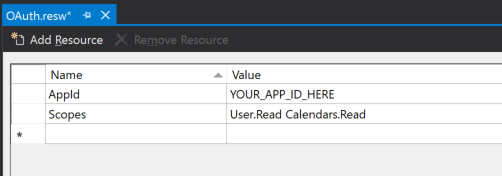

<!-- markdownlint-disable MD002 MD041 -->

<span data-ttu-id="b44eb-101">Neste exercício, você estenderá o aplicativo do exercício anterior para oferecer suporte à autenticação com o Azure AD.</span><span class="sxs-lookup"><span data-stu-id="b44eb-101">In this exercise you will extend the application from the previous exercise to support authentication with Azure AD.</span></span> <span data-ttu-id="b44eb-102">Isso é necessário para obter o token de acesso OAuth necessário para chamar o Microsoft Graph.</span><span class="sxs-lookup"><span data-stu-id="b44eb-102">This is required to obtain the necessary OAuth access token to call the Microsoft Graph.</span></span> <span data-ttu-id="b44eb-103">Nesta etapa, você integrará o controle **LoginButton** dos [controles do Windows Graph](https://github.com/windows-toolkit/Graph-Controls) para o aplicativo.</span><span class="sxs-lookup"><span data-stu-id="b44eb-103">In this step you will integrate the **LoginButton** control from the [Windows Graph Controls](https://github.com/windows-toolkit/Graph-Controls) into the application.</span></span>

1. <span data-ttu-id="b44eb-104">Clique com o botão direito do mouse no projeto **GraphTutorial** no Gerenciador de soluções e selecione **Adicionar > novo item...**. Escolha **arquivo de recursos (. resw)**, nomeie o `OAuth.resw` arquivo e selecione **Adicionar**.</span><span class="sxs-lookup"><span data-stu-id="b44eb-104">Right-click the **GraphTutorial** project in Solution Explorer and select **Add > New Item...**. Choose **Resources File (.resw)**, name the file `OAuth.resw` and select **Add**.</span></span> <span data-ttu-id="b44eb-105">Quando o novo arquivo é aberto no Visual Studio, crie dois recursos da seguinte maneira.</span><span class="sxs-lookup"><span data-stu-id="b44eb-105">When the new file opens in Visual Studio, create two resources as follows.</span></span>

    - <span data-ttu-id="b44eb-106">**Name:** `AppId`, **Value:** a ID do aplicativo que você gerou no portal de registro do aplicativo</span><span class="sxs-lookup"><span data-stu-id="b44eb-106">**Name:** `AppId`, **Value:** the app ID you generated in Application Registration Portal</span></span>
    - <span data-ttu-id="b44eb-107">**Nome:** `Scopes`, **valor:**`User.Read Calendars.Read`</span><span class="sxs-lookup"><span data-stu-id="b44eb-107">**Name:** `Scopes`, **Value:** `User.Read Calendars.Read`</span></span>

    

    > [!IMPORTANT]
    > <span data-ttu-id="b44eb-109">Se você estiver usando o controle de origem como o Git, agora seria uma boa hora para excluir `OAuth.resw` o arquivo do controle de origem para evitar vazar inadvertidamente sua ID de aplicativo.</span><span class="sxs-lookup"><span data-stu-id="b44eb-109">If you're using source control such as git, now would be a good time to exclude the `OAuth.resw` file from source control to avoid inadvertently leaking your app ID.</span></span>

## <a name="configure-the-loginbutton-control"></a><span data-ttu-id="b44eb-110">Configurar o controle LoginButton</span><span class="sxs-lookup"><span data-stu-id="b44eb-110">Configure the LoginButton control</span></span>

1. <span data-ttu-id="b44eb-111">Abra `MainPage.xaml.cs` e adicione a seguinte `using` instrução à parte superior do arquivo.</span><span class="sxs-lookup"><span data-stu-id="b44eb-111">Open `MainPage.xaml.cs` and add the following `using` statement to the top of the file.</span></span>

    ```csharp
    using Microsoft.Toolkit.Graph.Providers;
    ```

1. <span data-ttu-id="b44eb-112">Substitua o Construtor existente pelo seguinte.</span><span class="sxs-lookup"><span data-stu-id="b44eb-112">Replace the existing constructor with the following.</span></span>

    :::code language="csharp" source="../demo/GraphTutorial/MainPage.xaml.cs" id="ConstructorSnippet":::

    <span data-ttu-id="b44eb-113">Este código carrega as configurações de `OAuth.resw` e inicializa o provedor MSAL com esses valores.</span><span class="sxs-lookup"><span data-stu-id="b44eb-113">This code loads the settings from `OAuth.resw` and initializes the MSAL provider with those values.</span></span>

1. <span data-ttu-id="b44eb-114">Agora, adicione um manipulador de eventos `ProviderUpdated` para o evento `ProviderManager`no.</span><span class="sxs-lookup"><span data-stu-id="b44eb-114">Now add an event handler for the `ProviderUpdated` event on the `ProviderManager`.</span></span> <span data-ttu-id="b44eb-115">Adicione a função a seguir à classe `MainPage`.</span><span class="sxs-lookup"><span data-stu-id="b44eb-115">Add the following function to the `MainPage` class.</span></span>

    :::code language="csharp" source="../demo/GraphTutorial/MainPage.xaml.cs" id="ProviderUpdatedSnippet":::

    <span data-ttu-id="b44eb-116">Esse evento é acionado quando o provedor é alterado ou quando o estado do provedor é alterado.</span><span class="sxs-lookup"><span data-stu-id="b44eb-116">This event triggers when the provider changes, or when the provider state changes.</span></span>

1. <span data-ttu-id="b44eb-117">No Gerenciador de soluções, expanda **homepage. XAML** e abrir `HomePage.xaml.cs`.</span><span class="sxs-lookup"><span data-stu-id="b44eb-117">In Solution Explorer, expand **HomePage.xaml** and open `HomePage.xaml.cs`.</span></span> <span data-ttu-id="b44eb-118">Substitua o Construtor existente pelo seguinte.</span><span class="sxs-lookup"><span data-stu-id="b44eb-118">Replace the existing constructor with the following.</span></span>

    :::code language="csharp" source="../demo/GraphTutorial/HomePage.xaml.cs" id="ConstructorSnippet":::

1. <span data-ttu-id="b44eb-119">Reinicie o aplicativo e clique no controle de **entrada** na parte superior do aplicativo.</span><span class="sxs-lookup"><span data-stu-id="b44eb-119">Restart the app and click the **Sign In** control at the top of the app.</span></span> <span data-ttu-id="b44eb-120">Depois que você entrar, a interface do usuário deverá mudar para indicar que você entrou com êxito.</span><span class="sxs-lookup"><span data-stu-id="b44eb-120">Once you've signed in, the UI should change to indicate that you've successfully signed-in.</span></span>

    

    > [!NOTE]
    > <span data-ttu-id="b44eb-122">O `ButtonLogin` controle implementa a lógica de armazenamento e atualização do token de acesso para você.</span><span class="sxs-lookup"><span data-stu-id="b44eb-122">The `ButtonLogin` control implements the logic of storing and refreshing the access token for you.</span></span> <span data-ttu-id="b44eb-123">Os tokens são armazenados no armazenamento seguro e atualizados conforme necessário.</span><span class="sxs-lookup"><span data-stu-id="b44eb-123">The tokens are stored in secure storage and refreshed as needed.</span></span>
