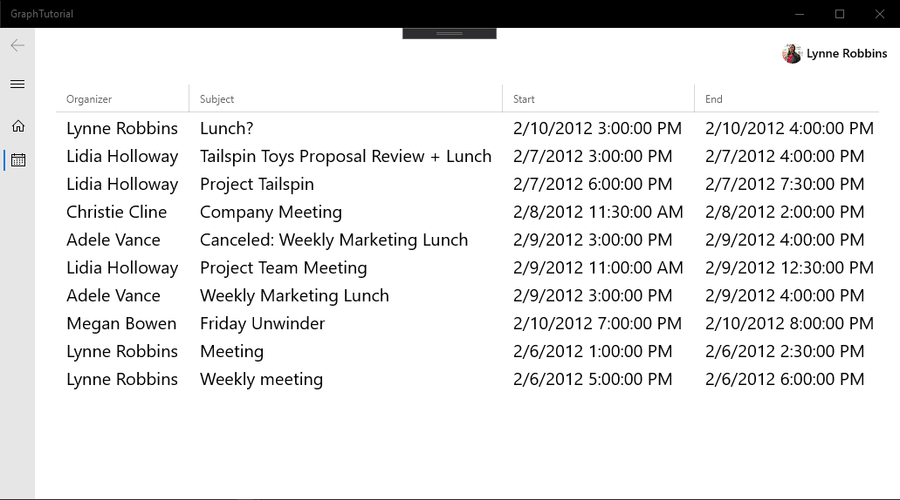

<!-- markdownlint-disable MD002 MD041 -->

Neste exercício, você incorporará o Microsoft Graph no aplicativo. Para este aplicativo, você usará a [biblioteca de cliente do Microsoft Graph para .net](https://github.com/microsoftgraph/msgraph-sdk-dotnet) para fazer chamadas para o Microsoft Graph.

## <a name="get-calendar-events-from-outlook"></a>Obter eventos de calendário do Outlook

1. Adicione uma nova página para o modo de exibição de calendário. Clique com o botão direito do mouse no projeto **GraphTutorial** no Gerenciador de soluções e selecione **Adicionar > novo item...**. Escolha **página em branco**, `CalendarPage.xaml` digite no campo **nome** e selecione **Adicionar**.

1. Abra `CalendarPage.xaml` e adicione a seguinte linha dentro do elemento `<Grid>` existente.

    ```xaml
    <TextBlock x:Name="Events" TextWrapping="Wrap"/>
    ```

1. Abra `CalendarPage.xaml.cs` e adicione as seguintes `using` instruções na parte superior do arquivo.

    ```csharp
    using Microsoft.Toolkit.Graph.Providers;
    using Microsoft.Toolkit.Uwp.UI.Controls;
    using Newtonsoft.Json;
    ```

1. Adicione as seguintes funções à `CalendarPage` classe.

    ```csharp
    private void ShowNotification(string message)
    {
        // Get the main page that contains the InAppNotification
        var mainPage = (Window.Current.Content as Frame).Content as MainPage;

        // Get the notification control
        var notification = mainPage.FindName("Notification") as InAppNotification;

        notification.Show(message);
    }

    protected override async void OnNavigatedTo(NavigationEventArgs e)
    {
        // Get the Graph client from the provider
        var graphClient = ProviderManager.Instance.GlobalProvider.Graph;

        try
        {
            // Get the events
            var events = await graphClient.Me.Events.Request()
                .Select("subject,organizer,start,end")
                .OrderBy("createdDateTime DESC")
                .GetAsync();

            // TEMPORARY: Show the results as JSON
            Events.Text = JsonConvert.SerializeObject(events.CurrentPage);
        }
        catch(Microsoft.Graph.ServiceException ex)
        {
            ShowNotification($"Exception getting events: {ex.Message}");
        }

        base.OnNavigatedTo(e);
    }
    ```

    Considere o que o código `OnNavigatedTo` está fazendo.

    - A URL que será chamada é `/v1.0/me/events`.
    - A `Select` função limita os campos retornados para cada evento para apenas aqueles que o modo de exibição realmente usará.
    - A `OrderBy` função classifica os resultados pela data e hora em que foram criados, com o item mais recente em primeiro lugar.

1. Modifique o `NavView_ItemInvoked` método no `MainPage.xaml.cs` arquivo para substituir a instrução existente `switch` pelo seguinte.

    :::code language="csharp" source="../demo/GraphTutorial/MainPage.xaml.cs" id="SwitchStatementSnippet" highlight="4":::

Agora, você pode executar o aplicativo, entrar e clicar no item de navegação **calendário** no menu à esquerda. Você deve ver um despejo JSON dos eventos no calendário do usuário.

## <a name="display-the-results"></a>Exibir os resultados

1. Substitua todo o conteúdo de `CalendarPage.xaml` com o seguinte.

    ```xaml
    <Page
        x:Class="GraphTutorial.CalendarPage"
        xmlns="http://schemas.microsoft.com/winfx/2006/xaml/presentation"
        xmlns:x="http://schemas.microsoft.com/winfx/2006/xaml"
        xmlns:local="using:GraphTutorial"
        xmlns:d="http://schemas.microsoft.com/expression/blend/2008"
        xmlns:mc="http://schemas.openxmlformats.org/markup-compatibility/2006"
        xmlns:controls="using:Microsoft.Toolkit.Uwp.UI.Controls"
        mc:Ignorable="d"
        Background="{ThemeResource ApplicationPageBackgroundThemeBrush}">

        <Grid>
            <controls:DataGrid x:Name="EventList" Grid.Row="1"
                    AutoGenerateColumns="False">
                <controls:DataGrid.Columns>
                    <controls:DataGridTextColumn
                            Header="Organizer"
                            Width="SizeToCells"
                            Binding="{Binding Organizer.EmailAddress.Name}"
                            FontSize="20" />
                    <controls:DataGridTextColumn
                            Header="Subject"
                            Width="SizeToCells"
                            Binding="{Binding Subject}"
                            FontSize="20" />
                    <controls:DataGridTextColumn
                            Header="Start"
                            Width="SizeToCells"
                            Binding="{Binding Start.DateTime}"
                            FontSize="20" />
                    <controls:DataGridTextColumn
                            Header="End"
                            Width="SizeToCells"
                            Binding="{Binding End.DateTime}"
                            FontSize="20" />
                </controls:DataGrid.Columns>
            </controls:DataGrid>
        </Grid>
    </Page>
    ```

1. Abra `CalendarPage.xaml.cs` e substitua a `Events.Text = JsonConvert.SerializeObject(events.CurrentPage);` linha pelo seguinte.

    ```csharp
    EventList.ItemsSource = events.CurrentPage.ToList();
    ```

    Se você executar o aplicativo agora e selecionar o calendário, você deve obter uma lista de eventos em uma grade de dados. No entanto, os valores **inicial** e **final** são exibidos de forma não amigável. Você pode controlar como esses valores são exibidos usando um [conversor de valor](https://docs.microsoft.com/uwp/api/Windows.UI.Xaml.Data.IValueConverter).

1. Clique com o botão direito do mouse no projeto **GraphTutorial** no Gerenciador de soluções e selecione **Adicionar > classe...**. Nomeie a classe `GraphDateTimeTimeZoneConverter.cs` e selecione **Adicionar**. Substitua todo o conteúdo do arquivo pelo seguinte.

    :::code language="csharp" source="../demo/GraphTutorial/GraphDateTimeTimeZoneConverter.cs" id="ConverterSnippet":::

    Este código usa a estrutura [dateTimeTimeZone](/graph/api/resources/datetimetimezone?view=graph-rest-1.0) retornada pelo Microsoft Graph e o analisa em um `DateTimeOffset` objeto. Em seguida, converte o valor no fuso horário do usuário e retorna o valor formatado.

1. Abra `CalendarPage.xaml` e adicione o seguinte **antes** do `<Grid>` elemento.

    :::code language="xaml" source="../demo/GraphTutorial/CalendarPage.xaml" id="ResourcesSnippet":::

1. Substitua os dois `DataGridTextColumn` últimos elementos pelo seguinte.

    :::code language="xaml" source="../demo/GraphTutorial/CalendarPage.xaml" id="BindingSnippet" highlight="4,9":::

1. Execute o aplicativo, entre e clique no item de navegação **calendário** . Você deve ver a lista de eventos com os valores **inicial** e **final** formatados.

    
