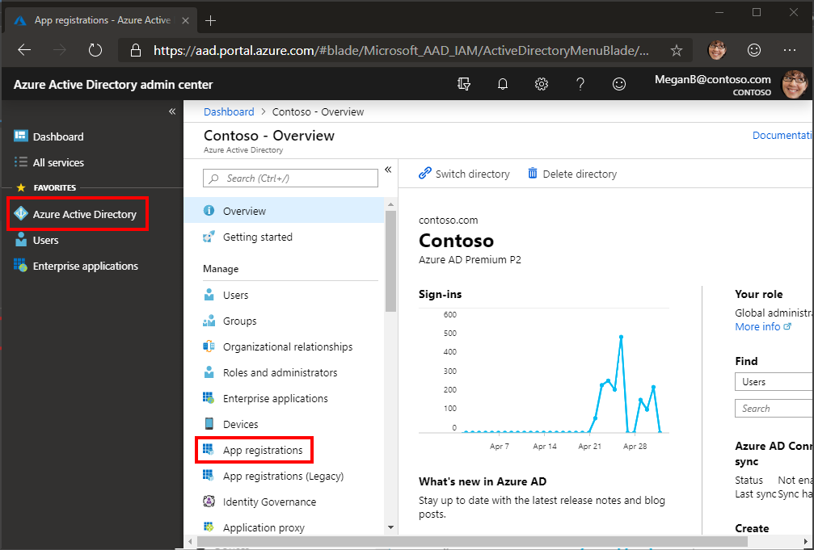

<!-- markdownlint-disable MD002 MD041 -->

Neste exercício, você criará um novo aplicativo nativo do Azure AD usando o centro de administração do Azure Active Directory.

1. Abra um navegador e navegue até o [centro de administração do Azure Active Directory](https://aad.portal.azure.com) e faça logon usando uma **conta pessoal** (aka: conta da Microsoft) ou **conta corporativa ou de estudante**.

1. Selecione **Azure Active Directory** na navegação à esquerda e, em seguida, selecione **registros de aplicativo (visualização)** em **gerenciar**.

    

1. Selecione **novo registro**. Na página **registrar um aplicativo** , defina os valores da seguinte maneira.

    - Defina **** o nome `UWP Graph Tutorial`como.
    - Defina os **tipos de conta com suporte** para **contas em qualquer diretório organizacional e contas pessoais da Microsoft**.
    - Deixe o **URI** de redirecionamento vazio.

    

1. Escolha **registrar**. Na página do **tutorial do gráfico UWP** , copie o valor da **ID do aplicativo (cliente)** e salve-o, você precisará dele na próxima etapa.

    

1. Selecione o link **Adicionar um URI** de redirecionamento. Na página **redirecionar URIs** , localize a seção reDirecionar **URIs sugeridos para clientes públicos (móvel, área de trabalho)** . Selecione o `urn:ietf:wg:oauth:2.0:oob` URI e, em seguida, escolha **salvar**.

    